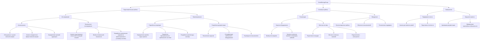

```mermaid
graph TD;
    A[GreenEnergyGroup] --> B[Подготовительные работы];
    B --> C[Исследование];
    C --> D[Анализ рынка];
    D --> E[Сбор данных о рынке зеленой энергии];
    D --> F[Анализ конкурентов в сфере зеленой энергии];
    D --> G[Определение целевой аудитории];
    C --> H[Техническое исследование];
    H --> I[Анализ существующих технологий генераций энергии];
    H --> J[Выбор оптимальной технологии];
    H --> K[Разработка технического задания на проектирование и установку системы];
    B --> L[Проектирование];
    L --> M[Разработка концепции];
    M --> N[Определение целей и задач проекта];
    M --> O[Разработка функциональных требований к системе];
    M --> P[Разработка архитектуры системы];
    L --> Q[Разработка документации];
    Q --> R[Техническое задание];
    Q --> S[Спецификация требований к оборудованию];
    Q --> T[Руководство пользователя];
    A --> U[Основные работы];
    U --> V[Реализация];
    V --> W[Закупка оборудования];
    W --> X[Выбор поставщиков];
    W --> Y[Закупка солнечных панелей, инверторов, кабелей];
    V --> Z[Монтаж системы];
    Z --> AA[Подготовка площадки];
    Z --> AB[Монтаж солнечных панелей];
    Z --> AC[Подключение к электросети];
    U --> AD[Внедрение];
    AD --> AE[Пусконаладочные работы];
    AD --> AF[Обучение пользователей];
    AD --> AG[Техническая поддержка];
    A --> AH[Завершение];
    AH --> AI[Подведение итогов];
    AI --> AJ[Анализ достижения целей];
    AI --> AK[Подготовка отчетности];
    AH --> AL[Закрытие проекта];
    AL --> AM[Архивация документации];
    AL --> AN[Оформление гарантийных обязательств];
```
